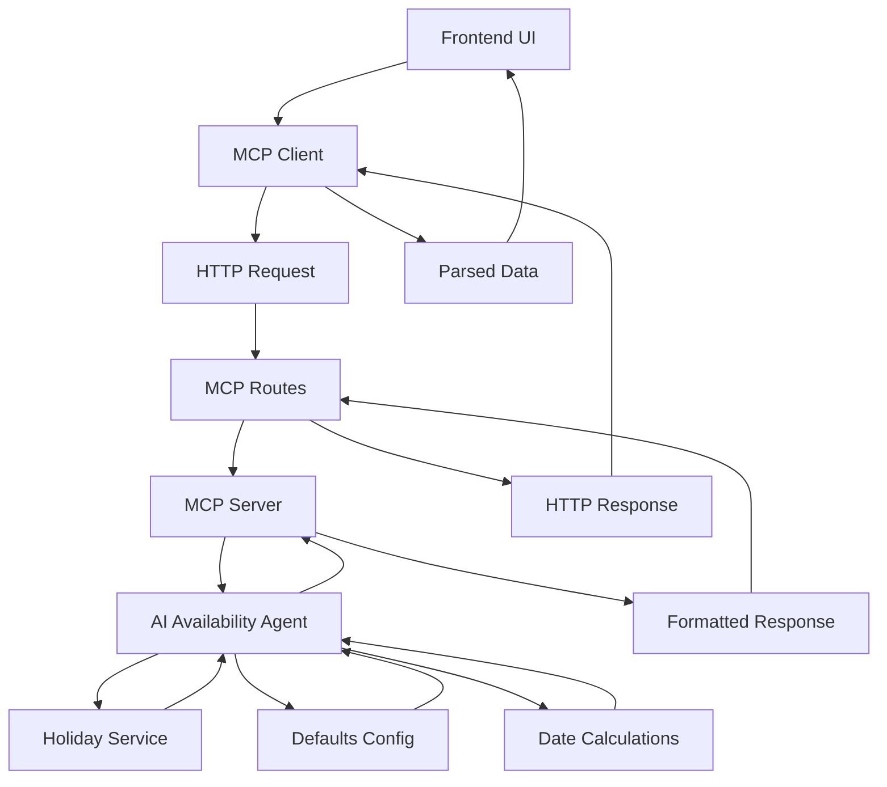

# 🤖 MCP Architecture for NDB Capacity Planner

## Overview

The NDB Capacity Planner implements a **Model Context Protocol (MCP) server** to expose AI-powered availability analysis as a service. This architecture enables intelligent calculation of working days, deductions, and availability based on actual project dates.

## 🏗️ Architecture Components

### 1. **AI Availability Agent** (`frontend/src/lib/availabilityAgent.ts`)
- **Purpose**: Core AI logic for analyzing project availability
- **Features**:
  - Intelligent working days calculation
  - Holiday, hackathon, and vacation analysis
  - AI insights and recommendations
  - Date validation and gap analysis

### 2. **MCP Server** (`backend/src/mcp/server.ts`)
- **Purpose**: Exposes AI agent functionality via MCP protocol
- **Features**:
  - Tool definitions and schemas
  - Request/response handling
  - Error management
  - Structured data formatting

### 3. **MCP HTTP Routes** (`backend/src/routes/mcp.ts`)
- **Purpose**: HTTP endpoints for MCP server functionality
- **Endpoints**:
  - `GET /api/mcp/tools` - List available tools
  - `POST /api/mcp/call-tool` - Execute tool calls

### 4. **MCP Client** (`frontend/src/lib/mcpClient.ts`)
- **Purpose**: Frontend interface to MCP server
- **Features**:
  - Tool call abstraction
  - Response parsing
  - Error handling
  - Type safety

## 🛠️ Available Tools

### 1. `analyze_availability`
**Purpose**: Analyze project availability using AI agent
```typescript
{
  executeCommitDate: string;    // ISO 8601 format
  softCodeCompleteDate: string; // ISO 8601 format
  gaDate: string;               // ISO 8601 format
}
```

**Returns**: Comprehensive availability analysis with:
- Working days calculations
- Deductions breakdown (holidays, hackathon, vacations)
- Final availability metrics
- AI insights and recommendations

### 2. `get_holidays`
**Purpose**: Get holidays for a specific date range
```typescript
{
  startDate: string;  // ISO 8601 format
  endDate: string;    // ISO 8601 format
  region?: string;    // Default: 'US'
}
```

### 3. `get_hackathon_days`
**Purpose**: Get hackathon days for a specific date range
```typescript
{
  startDate: string;  // ISO 8601 format
  endDate: string;    // ISO 8601 format
}
```

### 4. `calculate_vacation_days`
**Purpose**: Calculate vacation days for a specific period
```typescript
{
  startDate: string;      // ISO 8601 format
  endDate: string;        // ISO 8601 format
  totalStartDate: string; // ISO 8601 format
  totalEndDate: string;   // ISO 8601 format
}
```

### 5. `get_defaults`
**Purpose**: Get default configuration values
```typescript
{
  category?: string; // 'vacation_policy', 'date_gaps', 'hackathon_config', 'ndb_release_config', 'all'
}
```

### 6. `validate_date_gaps`
**Purpose**: Validate if dates align with configured date gaps
```typescript
{
  dates: {
    gaDate?: string;
    promotionGateDate?: string;
    commitGateDate?: string;
    softCodeCompleteDate?: string;
    executeCommitDate?: string;
    conceptCommitDate?: string;
    preCcCompleteDate?: string;
  };
  dateGaps: {
    gaToPromotionGate: number;
    promotionGateToCommitGate: number;
    commitGateToSoftCodeComplete: number;
    softCodeCompleteToExecuteCommit: number;
    executeCommitToConceptCommit: number;
    conceptCommitToPreCC: number;
  };
}
```

## 🚀 Getting Started

### 1. Start the MCP Server
```bash
# From project root
./start-mcp-server.sh
```

### 2. Use the MCP Client
```typescript
import { mcpClient } from '@/lib/mcpClient';

// Analyze availability
const analysis = await mcpClient.analyzeAvailability(
  '2024-01-01',
  '2024-06-01',
  '2024-12-01'
);

// Get holidays
const holidays = await mcpClient.getHolidays(
  '2024-01-01',
  '2024-12-31',
  'US'
);
```

## 🔧 Configuration

### Environment Variables
```bash
# MCP Server URL (for frontend client)
NEXT_PUBLIC_MCP_SERVER_URL=http://localhost:3001/mcp

# MCP Server Port (for backend)
MCP_SERVER_PORT=3001
```

### Dependencies
```json
{
  "@modelcontextprotocol/sdk": "^0.4.0"
}
```

## 📊 Data Flow



## 🎯 Key Features

### 1. **Intelligent Analysis**
- AI-powered availability calculation
- Context-aware deductions
- Smart insights and recommendations

### 2. **Comprehensive Coverage**
- US federal holidays
- Indian festivals and holidays
- Company wellness days (3 per year)
- Hackathon days (February)
- Vacation policy (18 paid leave days/year)

### 3. **Flexible Architecture**
- MCP protocol compliance
- HTTP API endpoints
- Type-safe client interface
- Extensible tool system

### 4. **Production Ready**
- Error handling
- Input validation
- Structured responses
- Comprehensive logging

## 🔍 Usage Examples

### Basic Availability Analysis
```typescript
const analysis = await mcpClient.analyzeAvailability(
  '2024-03-01',  // Execute Commit
  '2024-08-01',  // Soft Code Complete
  '2024-11-12'   // GA Date
);

console.log(`Total Available Days: ${analysis.availability.totalAvailableDays}`);
console.log(`Efficiency: ${analysis.availability.efficiency}%`);
```

### Holiday Analysis
```typescript
const holidays = await mcpClient.getHolidays(
  '2024-01-01',
  '2024-12-31'
);

console.log(`Total Holidays: ${holidays.count}`);
```

### Configuration Retrieval
```typescript
const vacationPolicy = await mcpClient.getDefaults('vacation_policy');
console.log(`Paid Leave Days: ${vacationPolicy.paidLeaveDays}`);
```

## 🛡️ Error Handling

The MCP server provides comprehensive error handling:

- **Input Validation**: All inputs are validated against schemas
- **Date Validation**: Ensures logical date ordering
- **Error Responses**: Structured error messages with context
- **Logging**: Comprehensive logging for debugging

## 🔮 Future Enhancements

1. **Real-time Updates**: WebSocket support for live updates
2. **Caching**: Redis integration for improved performance
3. **Analytics**: Usage tracking and performance metrics
4. **Multi-region**: Support for multiple holiday regions
5. **Custom Policies**: User-defined vacation and holiday policies

## 📚 API Documentation

For detailed API documentation, see:
- [MCP Server API](./backend/src/mcp/server.ts)
- [MCP Routes API](./backend/src/routes/mcp.ts)
- [MCP Client API](./frontend/src/lib/mcpClient.ts)

## 🤝 Contributing

When adding new tools or features:

1. Define the tool schema in `server.ts`
2. Implement the handler in `routes/mcp.ts`
3. Add client method in `mcpClient.ts`
4. Update this documentation
5. Add tests for the new functionality

---

**Built with ❤️ for NDB Capacity Planning**
